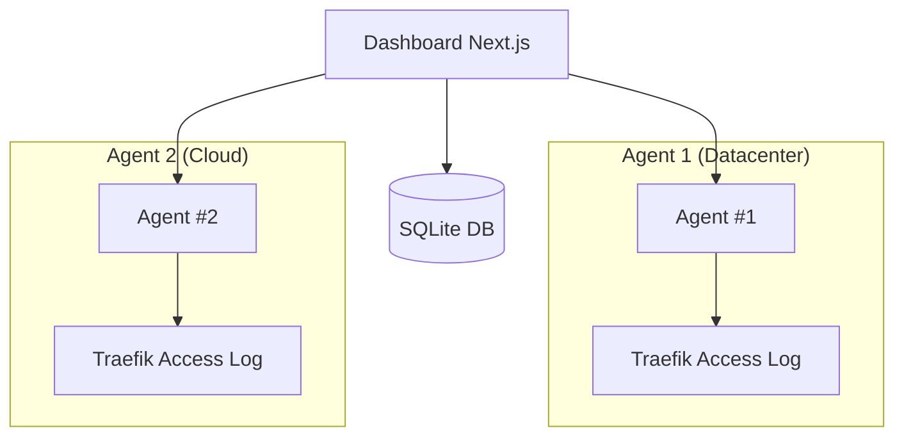

    <h1 align="center">Traefik Log Dashboard</h1>

A comprehensive analytics platform for Traefik access logs with three deployment options: a Go-based API agent, a modern Next.js web dashboard, and a beautiful terminal-based CLI.

**A comprehensive real-time analytics platform for Traefik reverse proxy logs**

## Overview

Traefik Log Dashboard is a powerful analytics platform that provides real-time insights into your Traefik reverse proxy traffic. It consists of three components that work together:

1. **Agent** - Go-based backend API that parses logs and exposes metrics
2. **Dashboard** - Next.js web UI with interactive charts and real-time updates
3. **CLI** - Beautiful terminal-based dashboard (optional)

### Key Features

- ✅ **Multi-Agent Architecture** - Manage multiple Traefik instances from a single dashboard
- ✅ **Persistent Agent Database** - SQLite-based storage for agent configurations
- ✅ **Environment-Protected Agents** - Agents defined in docker-compose.yml cannot be deleted from UI
- ✅ **Enhanced Error Handling** - Better error messages and user feedback
- ✅ **Improved Performance** - Parallel fetching and optimized state management
- ✅ **Fixed Date Handling** - Proper ISO string and Date object conversion
- ✅ **Better Agent Status Tracking** - lastSeen timestamp with proper persistence

## Architecture

### Multi-Agent Architecture

The platform supports a **multi-agent architecture** where you can deploy multiple agent instances across different Traefik installations and aggregate their data through a single dashboard.

**Key Architectural Components:**

1. **Dashboard** - Centralized web UI that communicates with multiple agents
2. **Agents** - Deployed alongside each Traefik instance to parse local logs
3. **SQLite Database** - Stores agent configurations, status, and metadata
4. **Token Authentication** - Secures communication between dashboard and agents
