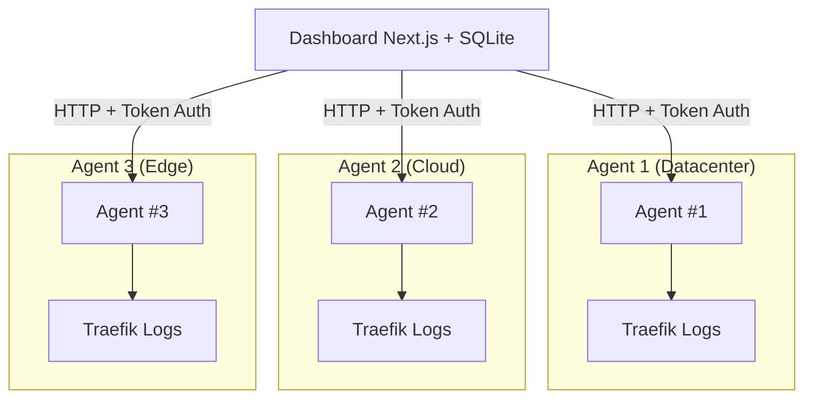

import { Callout } from 'fumadocs-ui/components/callout';
import { Step, Steps } from 'fumadocs-ui/components/steps';
import { Tab, Tabs } from 'fumadocs-ui/components/tabs';
import { Card, Cards } from 'fumadocs-ui/components/card';

# Traefik Log Dashboard

A comprehensive analytics platform for Traefik access logs with three deployment options: a Go-based API agent, a modern Next.js web dashboard, and a beautiful terminal-based CLI.

## Overview

Traefik Log Dashboard provides real-time insights into your Traefik reverse proxy traffic. It consists of three components:

<Steps>
<Step>
### Agent
Go-based backend API that parses logs and exposes metrics with high performance and low resource usage.
</Step>

<Step>
### Dashboard
Next.js 15 web UI with interactive charts, real-time updates, and beautiful visualizations including 3D globe and geographic maps. Includes automatic GeoIP lookup.
</Step>

<Step>
### CLI (Optional)
Beautiful terminal-based dashboard for monitoring directly from your command line.
</Step>
</Steps>

## Core Features

- **Multi-Agent Architecture** - Manage multiple Traefik instances from a single dashboard
- **Interactive Globe Visualization** - 3D globe with smooth transitions to geographic maps
- **Automatic GeoIP** - IP geolocation works out of the box
- **Advanced Filtering** - Include/exclude modes, country/city filtering, custom conditions
- **Background Alerting** - Discord webhooks, daily summaries, threshold alerts
- **Persistent Agent Database** - SQLite-based storage for agent configurations
- **High Performance** - Optimized log parsing, parallel fetching, lazy loading

## Architecture

### Multi-Agent Architecture

The platform supports a **multi-agent architecture** where you can deploy multiple agent instances across different Traefik installations and aggregate their data through a single dashboard.

### Key Architectural Components

1. **Dashboard** - Centralized web UI that communicates with multiple agents
2. **Agents** - Deployed alongside each Traefik instance to parse local logs
3. **SQLite Database** - Stores agent configurations, status, and metadata
4. **Token Authentication** - Secures communication between dashboard and agents

## Quick Navigation

<Tabs items={['Get Started', 'Configure', 'Features']}>
<Tab value="Get Started">
Check out our [Quick Start Guide](/docs/quickstart) to get up and running in minutes.
</Tab>
<Tab value="Configure">
Learn about [Configuration Options](/docs/configuration) including environment variables and settings.
</Tab>
<Tab value="Features">
Explore all [Features](/docs/features) including filtering, alerting, and geographic visualization.
</Tab>
</Tabs>

## Next Steps

<Cards>
  <Card
    title="Quick Start"
    description="Get started with Docker Compose in 5 minutes"
    href="/docs/quickstart"
  />
  <Card
    title="Configuration"
    description="Learn how to configure agents and the dashboard"
    href="/docs/configuration"
  />
  <Card
    title="Features"
    description="Explore all dashboard capabilities"
    href="/docs/features"
  />
  <Card
    title="Troubleshooting"
    description="Common issues and their solutions"
    href="/docs/troubleshooting"
  />
</Cards>
